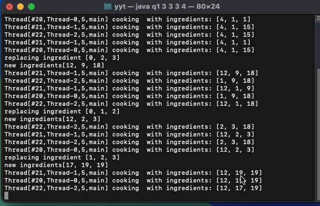
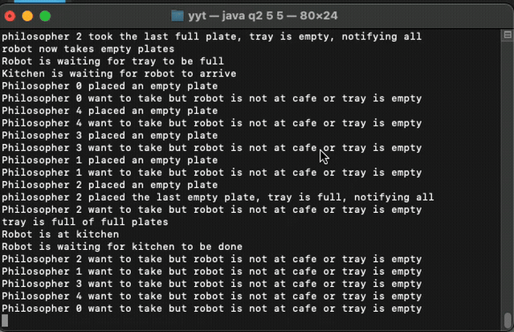

# Java Concurrency — Deadlock Prevention & Monitor Design

 

Two Java concurrency problems exploring **deadlock-free lock ordering**, **ReentrantReadWriteLock**, and **monitor-based synchronization** with `wait`/`notifyAll`.

> Built as part of McGill COMP 409 (Concurrent Programming).

---

## Q1 — Cook & Shopper (Deadlock-Free Ingredient Locking)

### Problem
Multiple **cook threads** each need to acquire locks on `k` random ingredients simultaneously to cook. A **shopper thread** periodically replaces `m` ingredients with new ones. Naively, cooks can deadlock — e.g. Cook 1 holds ingredient 1 and waits for 2, while Cook 2 holds ingredient 2 and waits for 1.

### Solution — Three Iterations

**Attempt 1 — Global lock ordering**
Sort each thread's ingredient list in ascending order before acquiring locks recursively. This breaks circular wait and prevents cook-cook deadlock. However, a cook holding locks 1,2,3 while waiting for 4 would be blocked if a shopper replaces ingredient 4 — the cook is stuck on a stale lock.

**Attempt 2 — Replace only the name, not the lock object**
Rejected on course discussion board.

**Attempt 3 — `ReentrantReadWriteLock` (final solution)**
Use a pantry-gate `ReentrantReadWriteLock` (fair mode):
- **Cooks** acquire the **read lock** — multiple cooks can cook concurrently
- **Shopper** acquires the **write lock** — blocks until all current cooks finish, then replaces ingredients exclusively

This gives barrier semantics: the shopper waits for all active cooks to complete before modifying the pantry, eliminating the stale-lock problem entirely.

```
Cook thread:    pantryGate.readLock().lock()  → sort picks → acquire ingredient locks recursively → cook
Shopper thread: pantryGate.writeLock().lock() → sort picks → replace ingredients recursively
```

### Demo



### Run
```bash
java q1.java <n> <k> <m> <K>
# n = number of cook threads
# k = ingredients each cook needs
# m = ingredients shopper replaces
# K = total ingredients in pantry
```

---

## Q2 — Cafe Monitor (Robot, Kitchen & Philosophers)

### Problem
`n` **philosophers** alternate between thinking and eating. To eat, a philosopher places an empty plate on a tray and takes back a full one. A **robot** collects the tray when all `k` plates are empty and brings it to the **kitchen**. The kitchen refills the plates and notifies the robot, who returns the full tray to the café.

### Solution — Shared Monitor (`CafeMonitor`)

A single `CafeMonitor` class encapsulates all shared state and uses Java's built-in `synchronized` + `wait` / `notifyAll` monitor:

| State | Purpose |
|---|---|
| `empty_on_tray` | Number of empty plates currently on tray |
| `full_on_tray` | Number of full plates currently on tray |
| `accepting_empty` | Whether the robot is at the café accepting empty plates |
| `at_kitchen` | Whether the robot is currently at the kitchen |
| `kitchen_done` | Whether the kitchen has finished refilling |

**Synchronization flow:**
```
Philosophers ──place_empty()──► tray fills up
                                      │
                              robot_wait_tray_full()
                                      │
                              robot_arrive_kitchen()
                                      │
                          kitchen_wait_for_robot() ◄── Kitchen
                          kitchen_finish_refill()  ──► notifyAll
                                      │
                              robot_wait_for_kitchen_done()
                              robot_return_to_cafe() ──► full_on_tray = k
                                      │
Philosophers ──take_full()────► tray empties
                                      │
                         robot_wait_for_all_full_plates_taken()
                         accepting_empty = true ──► cycle repeats
```

Each monitor method uses `while`-loop guards (not `if`) to handle spurious wakeups safely.

### Demo



### Run
```bash
java q2.java <n> <k>
# n = number of philosopher threads
# k = number of plates on the tray (capped at n)
```

---

## Key Concepts Demonstrated

| Concept | Where |
|---|---|
| Lock ordering to prevent deadlock | Q1 — `reorder_locks()` |
| `ReentrantReadWriteLock` (fair) | Q1 — `pantryGate` read/write |
| Recursive lock acquisition | Q1 — `acquire_locks_recursive()` |
| Monitor pattern (`synchronized` + `wait`/`notifyAll`) | Q2 — `CafeMonitor` |
| Spurious wakeup guards (`while` not `if`) | Q2 — all monitor methods |
| Multi-role thread coordination | Q2 — Philosopher / Robot / Kitchen |

---

## Stack

- **Language:** Java
- **Concurrency primitives:** `synchronized`, `ReentrantReadWriteLock`, `wait`, `notifyAll`, `Thread`
- **Course:** McGill COMP 409 — Concurrent Programming
